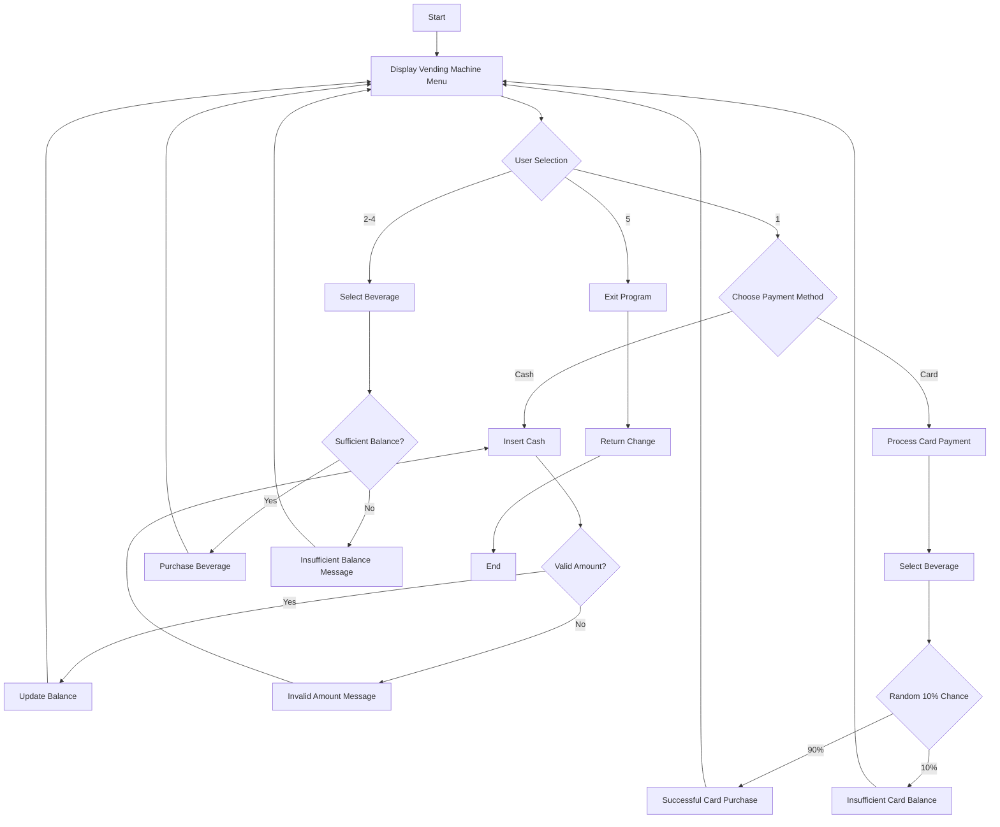

# jihoo-vending-machine

A simple vending machine program written in Node.js

## Environment

- Node.js v23.3.0

## Features

- Menu-driven interface
- Cash and card payment options
- Multiple beverage choices
- Balance tracking for cash payments
- Simulated card payment failures (10% chance)

## Flow Diagram

Written in [mermaid](https://github.com/mermaid-js/mermaid) syntax.



## How to Run
```bash
cd <PROJECT_DIR>
node main.js
```
